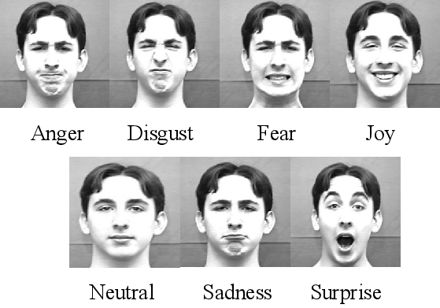

# Facial Recognition Project

This repository contains a **Facial Recognition** project that detects and recognizes faces using machine learning models.  

---

## Demo Image

Here is a sample output of the facial recognition system:



*Figure: Facial Recognition Output*

---

## Features

- Detects faces in images and videos
- Recognizes multiple faces simultaneously
- Works in real-time

---

## Installation

1. Clone the repository:

```bash
git clone https://github.com/your-username/your-repo.git
